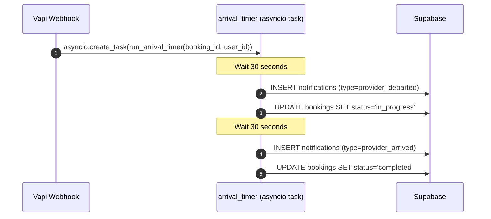

# 12 — Arrival Timer Background Worker

## Overview

After a booking is confirmed via the Vapi webhook, the system attempts to launch a background task that simulates the provider's journey to the user — first a "provider has left" notification, then a "provider has arrived" notification after a short interval. This gives the user real-time status updates during the demo.

**Current Error:**
```
[APP] Error triggering arrival timer worker from webhook: No module named 'app.workers.arrival_timer'
```

---

## 1. Root-Cause Analysis

### The Module Does Not Exist

In `vapi.py` L347-355, the webhook attempts to import and invoke the worker:

```python
# 3️⃣ Trigger arrival timer background task
try:
    booking_id = booking_output.booking_id
    if booking_id:
        import asyncio
        from app.workers.arrival_timer import run_arrival_timer
        asyncio.create_task(run_arrival_timer(booking_id, user_id))
except Exception as e:
    print(f"Error triggering arrival timer worker from webhook: {e}")
```

The `app/workers/` directory contains only an empty `__init__.py`:

```
backend/app/workers/
├── __init__.py          ← empty
└── __pycache__/
```

There is **no `arrival_timer.py` module**. The import fails with `ModuleNotFoundError`, the exception is caught and printed, and the feature silently fails.

### Why This Matters

The arrival timer is the mechanism that drives the real-time "Provider is on their way" → "Provider has arrived" status progression in the frontend. Without it:
- Users see no live status updates after booking confirmation.
- The booking stays in `confirmed` status indefinitely instead of transitioning through `in_progress` → `completed`.
- The demo flow feels incomplete — the user books but never sees the provider "arrive".

---

## 2. Proposed Design

### Module: `backend/app/workers/arrival_timer.py`

A single async function `run_arrival_timer(booking_id: str, user_id: str)` that:

1. **Waits 30 seconds**, then:
   - Inserts a `provider_departed` notification into the `notifications` table.
   - Updates the booking status from `confirmed` → `in_progress`.

2. **Waits another 30 seconds** (60s total from booking), then:
   - Inserts a `provider_arrived` notification into the `notifications` table.
   - Updates the booking status from `in_progress` → `completed`.

### Sequence Diagram



### Notification Row Schema

Each notification row inserted by the timer should follow the existing `notifications` table schema:

| Column         | Value                                                                      |
|----------------|----------------------------------------------------------------------------|
| `booking_id`   | The booking UUID passed to the worker                                      |
| `user_id`      | The user UUID passed to the worker                                         |
| `type`         | `provider_departed` or `provider_arrived`                                  |
| `message`      | Human-readable status message (see below)                                  |
| `scheduled_at` | `datetime.now(timezone.utc).isoformat()` (immediate — already "due")       |
| `sent_at`      | `datetime.now(timezone.utc).isoformat()` (mark as sent immediately)        |
| `status`       | `sent`                                                                     |

### Messages

| Type                 | Message                                                                          |
|----------------------|----------------------------------------------------------------------------------|
| `provider_departed`  | `"Your service provider has left and is on their way to you. ETA: ~30 minutes."` |
| `provider_arrived`   | `"Your service provider has arrived! Please be ready to greet them."`            |

---

## 3. Implementation Steps

### Step 1 — Create the worker module

Create `backend/app/workers/arrival_timer.py` with:

```python
import asyncio
from datetime import datetime, timezone
from mcp_server.db import supabase_client


async def run_arrival_timer(booking_id: str, user_id: str):
    """
    Background task that simulates provider departure and arrival
    with time-delayed notification inserts and booking status updates.

    Timeline (from booking confirmation):
      +30s  → provider_departed notification + booking status → in_progress
      +60s  → provider_arrived notification  + booking status → completed
    """
    try:
        # Phase 1: Provider departs (30s after booking)
        await asyncio.sleep(30)

        supabase_client.table("notifications").insert({
            "booking_id": booking_id,
            "user_id": user_id,
            "type": "provider_departed",
            "message": "Your service provider has left and is on their way to you. ETA: ~30 minutes.",
            "scheduled_at": datetime.now(timezone.utc).isoformat(),
            "sent_at": datetime.now(timezone.utc).isoformat(),
            "status": "sent",
        }).execute()

        supabase_client.table("bookings").update({
            "status": "in_progress"
        }).eq("id", booking_id).execute()

        print(f"[ArrivalTimer] provider_departed for booking {booking_id}")

        # Phase 2: Provider arrives (30s after departure = 60s total)
        await asyncio.sleep(30)

        supabase_client.table("notifications").insert({
            "booking_id": booking_id,
            "user_id": user_id,
            "type": "provider_arrived",
            "message": "Your service provider has arrived! Please be ready to greet them.",
            "scheduled_at": datetime.now(timezone.utc).isoformat(),
            "sent_at": datetime.now(timezone.utc).isoformat(),
            "status": "sent",
        }).execute()

        supabase_client.table("bookings").update({
            "status": "completed"
        }).eq("id", booking_id).execute()

        print(f"[ArrivalTimer] provider_arrived for booking {booking_id}")

    except Exception as e:
        print(f"[ArrivalTimer] Error in arrival timer for booking {booking_id}: {e}")
```

### Step 2 — No changes needed in `vapi.py`

The webhook already has the correct import path and `asyncio.create_task` invocation at L347-355. Once the module exists, the import will succeed.

### Step 3 — Verify asyncio event loop availability

The webhook endpoint is `async def handle_vapi_webhook(...)`, which runs inside FastAPI's async event loop. `asyncio.create_task()` should work here without additional setup. However, verify that the dev server (`scripts/dev_server.py`) uses an async-capable runner (uvicorn with asyncio).

---

## 4. Edge Cases & Error Handling

| Scenario                          | Handling                                                     |
|-----------------------------------|--------------------------------------------------------------|
| Booking deleted before timer fires | The DB update will silently succeed (no row matched), safe.  |
| Server restart during timer        | The in-memory task is lost. Acceptable for demo purposes.    |
| Duplicate timer creation           | Multiple notification rows inserted — cosmetically noisy but non-destructive. |
| Supabase connection failure        | Caught by the outer `try/except`, logged to stdout.          |

---

## 5. Definition of Success

- [ ] `backend/app/workers/arrival_timer.py` exists and exports `run_arrival_timer`.
- [ ] After a booking is confirmed via Vapi webhook, the `ModuleNotFoundError` no longer appears.
- [ ] ~30s after booking: a `provider_departed` row appears in `notifications`, booking status is `in_progress`.
- [ ] ~60s after booking: a `provider_arrived` row appears in `notifications`, booking status is `completed`.
- [ ] The main webhook response is NOT delayed — the timer runs as a background task.
