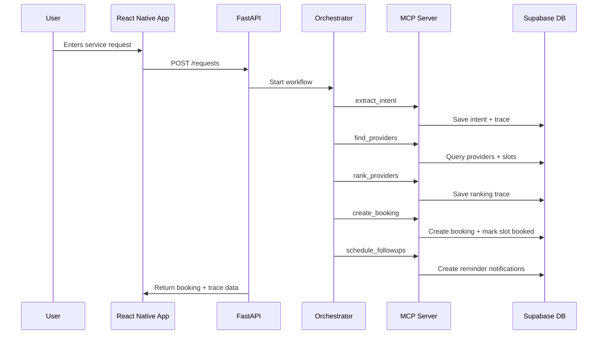

# Agents Context

## Agent Flow



## MCP Tools

| Tool                 | Purpose                                                 |
| -------------------- | ------------------------------------------------------- |
| `extract_intent`     | Extract service type, location, time, urgency, language |
| `find_providers`     | Find matching providers and available slots             |
| `rank_providers`     | Rank providers by rating, distance, and availability    |
| `create_booking`     | Create booking and confirmation code                    |
| `schedule_followups` | Schedule reminder and completion check                  |
| `write_trace_log`    | Save agent reasoning and tool outputs                   |

## Ranking Formula

```txt
score = 
  rating_score * 0.40 
  + proximity_score * 0.35 
  + availability_score * 0.25
```
