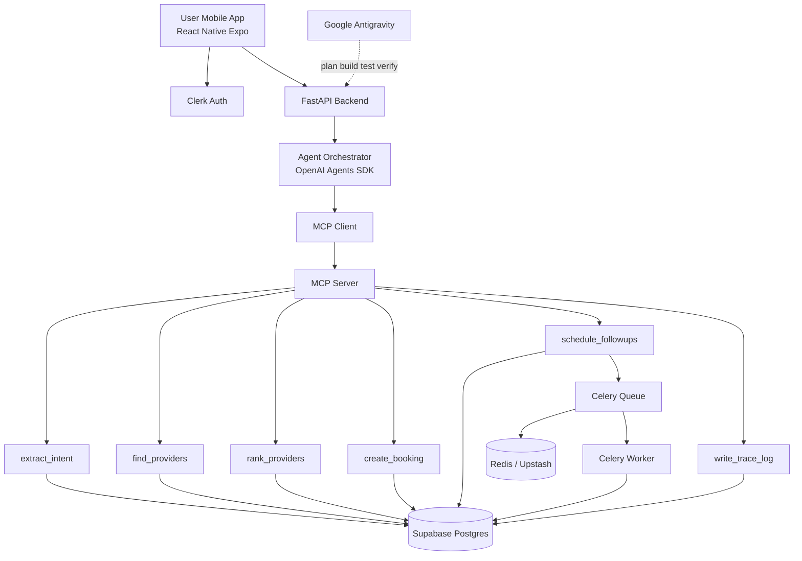
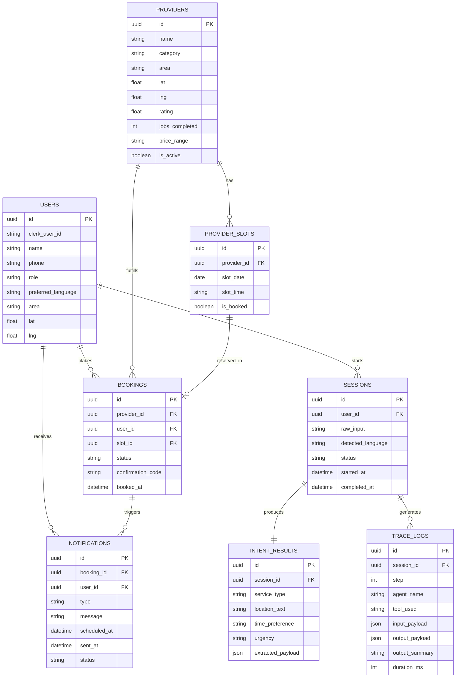

# Architecture Context

## Tech Stack

| Layer            | Technology          |
| ---------------- | ------------------- |
| Mobile App       | React Native + Expo |
| Backend API      | FastAPI             |
| Agent Runtime    | OpenAI Agents SDK   |
| Tool Layer       | MCP Server          |
| Database         | Supabase Postgres   |
| Auth             | Clerk               |
| Queue            | Celery + Redis      |
| Local Redis      | Docker Redis        |
| Production Redis | Upstash Redis       |
| Deployment       | Google Cloud Run    |
| Dev Workspace    | Google Antigravity  |

## High Level Architecture 



## Database Overview



## Backend Routes

| Method  | Route                                 | Purpose                    |
| ------- | ------------------------------------- | -------------------------- |
| `GET`   | `/health`                             | Health check               |
| `POST`  | `/requests`                           | Start full agent workflow  |
| `GET`   | `/requests/{session_id}`              | Get request/session result |
| `GET`   | `/requests/{session_id}/trace`        | Get agent trace logs       |
| `GET`   | `/requests/{session_id}/trace/export` | Export trace JSON          |
| `GET`   | `/providers`                          | List providers             |
| `GET`   | `/providers/{id}`                     | Provider details           |
| `POST`  | `/bookings`                           | Create manual booking      |
| `GET`   | `/bookings/{id}`                      | Booking receipt/status     |
| `POST`  | `/bookings/{id}/cancel`               | Cancel booking             |
| `POST`  | `/followups/trigger`                  | Demo trigger reminder      |
| `GET`   | `/me`                                 | Current user profile       |
| `GET`   | `/admin/traces`                       | Admin trace dashboard      |
| `GET`   | `/admin/sessions`                     | Admin sessions list        |
| `GET`   | `/admin/bookings`                     | Admin bookings list        |
| `GET`   | `/admin/providers`                    | Admin providers list       |
| `POST`  | `/admin/providers`                    | Add provider               |
| `PATCH` | `/admin/providers/{id}`               | Update provider            |

## Recommended Folder Structure 

```txt
backend/
  app/
    main.py
    core/
      config.py
      security.py
      celery_app.py
    db/
      session.py
      models.py
      schemas.py
    agents/
      orchestrator.py
      intent_agent.py
      discovery_agent.py
      ranking_agent.py
      booking_agent.py
      followup_agent.py
      prompts.py
      outputs.py
    api/
      routes/
        requests.py
        providers.py
        bookings.py
        traces.py
        admin.py
        me.py
    workers/
      tasks.py

  mcp_server/
    server.py
    tools/
      intent_tools.py
      provider_tools.py
      ranking_tools.py
      booking_tools.py
      notification_tools.py
      trace_tools.py

frontend/
  app/
    auth/
    customer/
    admin/
  components/
    AgentCard.tsx
    ProviderCard.tsx
    BookingReceipt.tsx
    TraceTimeline.tsx
  lib/
    api.ts
    auth.ts
  constants/
    routes.ts
```
