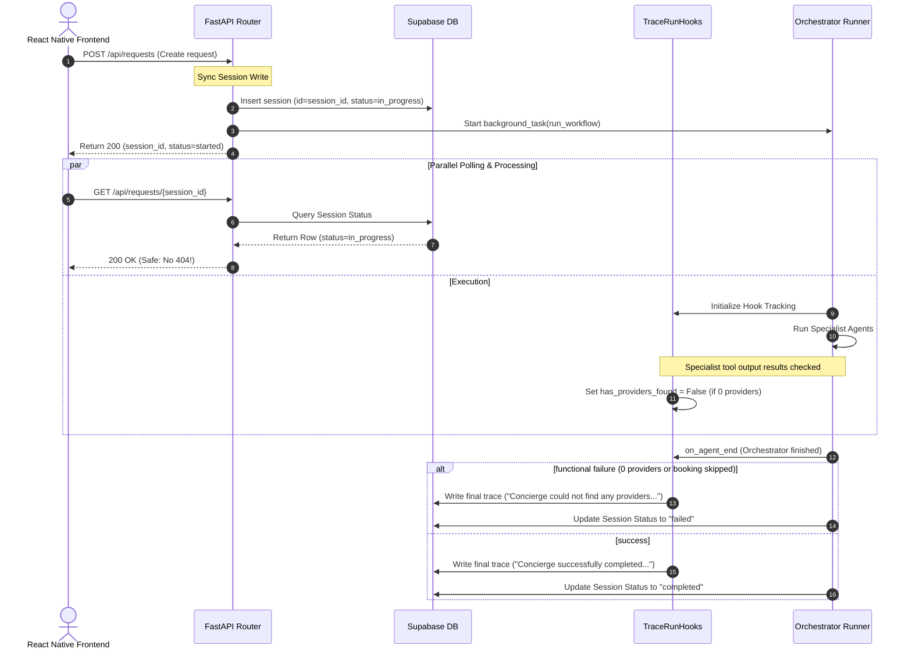

# 11 — Session Reliability & Functional Failure State Tracing

## Overview

To deliver a premium private concierge experience, the application's feedback loops must be extremely reliable and structurally accurate. Currently, we suffer from two critical deficiencies in request lifecycle coordination and trace representations:

1. **Session-Creation Race Condition**: When a user submits a service request, the backend creates a unique `session_id` and registers the orchestrator workflow as a background task. Because background tasks have a scheduling delay and the orchestrator must connect to the MCP server via SSE before executing `create_session`, the frontend immediately redirects and polls `/api/requests/{session_id}` before the row is inserted in the database. This causes the UI to display a frustrating **"Session not found. It may have expired."** error, even though the backend is actively processing the request.
2. **Functional Failure Misrepresentation**: If the orchestrator pipeline completes without raising a programmatic Python exception—even if the **Discovery Specialist** found 0 providers, or the **Booking Coordinator** failed to secure a slot, leading the coordinator to apologize—the backend still updates the session status to `"completed"`. Consequently, the final trace log proudly proclaims that the `"Concierge successfully completed the entire service orchestration pipeline,"` and the UI incorrectly acts as if the request succeeded.

This specification outlines a full-stack architectural design to resolve these synchronization and tracking deficiencies.

---

## 1. Technical Deficiencies & Analysis

### 1.1 Race Condition: Asynchronous Creation vs. Immediate Polling
In `/backend/app/api/routes/requests.py`, the `create_request` endpoint acts as follows:
```python
@router.post("/", response_model=RequestResponse)
async def create_request(...):
    user_id = str(current_user.id)
    session_id = str(uuid.uuid4())
    background_tasks.add_task(run_orchestrator_task, req.message, user_id, session_id)
    return RequestResponse(session_id=session_id, status="started")
```
The client receives the `session_id` immediately and begins polling `/api/requests/{session_id}`. However, in `/backend/app/agents/orchestrator.py`, the session creation occurs within the `run_workflow` background thread *after* connecting to the MCP Server:
```python
async def run_workflow(...):
    async with MCPServerSse(...) as mcp:
        # Step 0: Create Session
        await asyncio.to_thread(create_session, CreateSessionInput(
            user_id=user_id, raw_input=user_input, session_id=session_id
        ))
```
If establishing the SSE connection takes 1–2 seconds, the client's first 1 to 2 poll requests return a `404 Not Found` response. The frontend catches the `404` and immediately interrupts the flow by throwing a fatal "Session not found" state.

### 1.2 Status Fallacy: Programmatic Success vs. Functional Failure
If the Discovery Specialist returns 0 providers:
- The Ranking Agent has nothing to match.
- The Booking Agent has nothing to book.
- The Follow-up Agent has nothing to schedule.
- The Main AI Coordinator formulates an output apologizing to the user: *"I checked G-13 for AC Technicians tomorrow morning, but unfortunately, there are no active service slots available. Please try a different date."*

Because no Python exception was thrown, the workflow concludes its natural execution. The final lines in `orchestrator.py` execute:
```python
await asyncio.to_thread(update_session_status, UpdateSessionInput(
    session_id=session_id, status="completed"
))
```
This forces the session state to `"completed"`. The final `on_agent_end` trace hook fires:
```python
if agent.name.lower() == "orchestrator":
    summary = "Concierge successfully completed the entire service orchestration pipeline."
```
The user is left with a confusing UI: they see a green check, a successful completed pipeline trace, but a conversational message saying *"Sorry, I couldn't find anyone."*

---

## 2. Core Architectural Design

To address these bugs, we will implement two structural upgrades:



### 2.1 Sync Session Creation (Eliminating Race Conditions)
We will transition session record creation from the background worker thread directly into the synchronous endpoint pipeline:
1. When `create_request` receives a request, it creates the session in Supabase immediately *before* scheduling the background task and returning a response.
2. To make this safe for unit testing and independent scripts that call `run_workflow` directly, we will modify the database `create_session` implementation in `backend/mcp_server/tools/trace_tools.py` to perform an `upsert()` or safe duplicate-check rather than a raw `insert()`. This ensures that multiple programmatic attempts to initialize the same `session_id` are safe and idempotent.

### 2.2 Functional Outcome State Tracking & Custom Statuses
We will enhance `TraceRunHooks` in `backend/app/agents/hooks.py` to keep track of key specialist checkpoints:
1. **`self.has_providers_found`**: Tracks if the Discovery Specialist successfully returned matching providers.
2. **`self.has_booking_created`**: Tracks if the Booking Coordinator successfully booked a slot.

By examining these hooks inside `on_agent_end`, we can customize both the final trace logs and overall session statuses. If a request wanted to find/book a provider but failed to do so, we write a descriptive failure summary (e.g. *"Concierge could not locate any available professionals in your area."*) and update the session's overall state in Supabase to `"failed"` instead of `"completed"`.

---

## 3. Implementation Plan

### 3.1 Step 1: Idempotent Session Creation in trace_tools.py
Modify `create_session` in `backend/mcp_server/tools/trace_tools.py` to support safe `upsert` of session records. This guarantees that duplicate programmatic calls from tests or secondary runners don't trigger database primary key exceptions.

```python
def create_session(input: CreateSessionInput) -> CreateSessionOutput:
    """
    Creates or updates an agent session in the database safely (idempotently).
    """
    session_data = {
        "user_id": input.user_id,
        "raw_input": input.raw_input,
        "status": "in_progress",
    }
    if input.session_id:
        session_data["id"] = input.session_id

    # Use upsert to avoid primary key violations
    resp = (
        supabase_client.table("sessions")
        .upsert(session_data, on_conflict="id")
        .execute()
    )
    row = resp.data[0]
    return CreateSessionOutput(session_id=row["id"], status=row["status"])
```

### 3.2 Step 2: Synchronous Session Creation in requests.py
Update `create_request` in `backend/app/api/routes/requests.py` to synchronously invoke `create_session` before dispatching the background worker.

```python
from mcp_server.tools.trace_tools import create_session, CreateSessionInput

@router.post("/", response_model=RequestResponse)
async def create_request(req: RequestCreate, background_tasks: BackgroundTasks, current_user: User = Depends(get_current_user)):
    user_id = str(current_user.id)
    session_id = str(uuid.uuid4())
    
    # Synchronously write the session row to DB
    create_session(CreateSessionInput(
        user_id=user_id,
        raw_input=req.message,
        session_id=session_id
    ))
    
    # Start the orchestrator in the background safely
    background_tasks.add_task(run_orchestrator_task, req.message, user_id, session_id)
    
    return RequestResponse(session_id=session_id, status="started")
```

### 3.3 Step 3: State Tracking in TraceRunHooks (hooks.py)
Upgrade the `TraceRunHooks` class in `backend/app/agents/hooks.py` to record functional flags and write failure-appropriate summaries when completing the pipeline:

```python
class TraceRunHooks(RunHooksBase):
    def __init__(self, session_id: str):
        self.session_id = session_id
        self.step_counter = 1
        self.start_times = {}
        # New State Tracking Flags
        self.has_providers_found = None
        self.has_booking_created = False

    async def on_tool_end(self, context, agent, tool, result) -> None:
        # ... standard duration and output serialization logic ...
        tool_name = tool.name.lower()
        
        if "run_discovery" in tool_name or "find_providers" in tool_name:
            providers_count = 0
            if isinstance(output_payload, dict):
                providers = output_payload.get("providers", [])
                if isinstance(providers, list):
                    providers_count = len(providers)
                elif "result" in output_payload:
                    res_str = str(output_payload["result"])
                    import re
                    providers_count = len(re.findall(r'"provider_id"|id|name', res_str)) // 2 or 3
            
            # Set discovery state
            self.has_providers_found = providers_count > 0
            
        elif "run_booking" in tool_name or "create_booking" in tool_name:
            booking_id = None
            if isinstance(output_payload, dict):
                booking_id = output_payload.get("booking_id")
                if not booking_id and "result" in output_payload:
                    res_str = str(output_payload["result"])
                    import re
                    match = re.search(r'"booking_id":\s*"([^"]+)"', res_str)
                    if match:
                        booking_id = match.group(1)
            
            # Set booking state
            if booking_id:
                self.has_booking_created = True

    async def on_agent_end(self, context, agent, output) -> None:
        # ... standard duration and output serialization logic ...
        summary = f"Agent {agent.name} completed."
        
        if agent.name.lower() == "orchestrator":
            # Formulate outcome-based summaries
            if self.has_providers_found is False:
                summary = "Concierge could not locate any available professionals in your area."
            elif self.has_providers_found is True and not self.has_booking_created:
                summary = "Concierge was unable to secure an appointment slot with a matched professional."
            else:
                summary = "Concierge successfully completed the entire service orchestration pipeline."
```

### 3.4 Step 4: Final Session Status Resolution in orchestrator.py
Modify `run_workflow` in `backend/app/agents/orchestrator.py` to evaluate the tracking flags from `trace_run_hooks` and set the final status of the session accordingly:

```python
        try:
            # ... setup and runner execution ...
            result = await Runner.run(
                orchestrator,
                input=initial_message,
                hooks=trace_run_hooks,
                run_config=RunConfig(tracing_disabled=True, model_settings=ModelSettings(parallel_tool_calls=False)),
            )

            # Determine final status programmatically based on workflow execution
            final_status = "completed"
            if (
                trace_run_hooks.has_providers_found is False 
                or (trace_run_hooks.has_providers_found is True and not trace_run_hooks.has_booking_created)
            ):
                final_status = "failed"

            await asyncio.to_thread(update_session_status, UpdateSessionInput(
                session_id=session_id,
                status=final_status
            ))

        except Exception as e:
            await asyncio.to_thread(update_session_status, UpdateSessionInput(
                session_id=session_id,
                status="failed"
            ))
            raise e
```

### 3.5 Step 5: Frontend Clean-up
Ensure both `frontend/app/(tabs)/index.tsx` and `frontend/app/request/[id].tsx` handle the updated `"failed"` statuses cleanly:
1. When `sessionStatus === 'failed'`, ensure the UI displays the trace steps correctly. Since the traces are still loaded, the user will be able to see exactly at which step the failure happened (e.g., matching or discovery) because the status steps remain visible, but the hero header reads *"Request Failed"* with a detailed error or final explanation summary trace.
2. The user will be given a clear "Reset Console" or "Try Again" option, rather than a broken or false success state.

---

## 4. Implementation Checklist

| Task | Priority | Target File | Status |
| :--- | :---: | :--- | :---: |
| Make database `create_session` tool safe/idempotent via `upsert` | **P0** | `backend/mcp_server/tools/trace_tools.py` | ✅ |
| Create database session synchronously before launching the background task | **P0** | `backend/app/api/routes/requests.py` | ✅ |
| Implement `has_providers_found` and `has_booking_created` tracking variables inside execution hooks | **P1** | `backend/app/agents/hooks.py` | ✅ |
| Customize final `on_agent_end` summaries based on functional success/failure state | **P1** | `backend/app/agents/hooks.py` | ✅ |
| Evaluate tracking flags to resolve session status to `"failed"` on objective blockages | **P1** | `backend/app/agents/orchestrator.py` | ✅ |
| Validate frontend handles objective-failure states gracefully | **P2** | `/frontend` | ✅ |
| Verify unit tests continue to pass with idempotent session calls | **P2** | `/backend` | ✅ |
