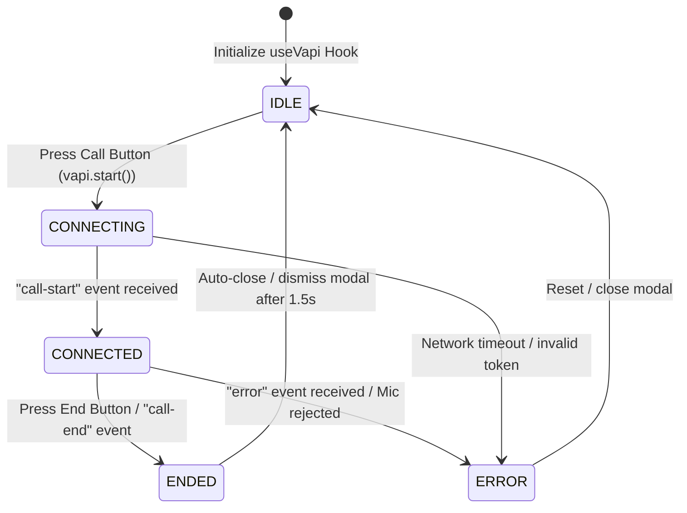

# 12 — Vapi Voice Assistant Integration

## Overview

To elevate the **Private Concierge** to a truly premium, high-end luxury experience, we will integrate a real-time, zero-latency voice calling system. Instead of typing complex, manual prompts, the user should be able to speak directly to the AI concierge. 

This specification outlines the integration of the **Vapi React Native SDK** (`@vapi-ai/react-native`) into our Expo-based mobile application. It covers:
1. A highly premium, pulsing **Call Button** in the main user interface.
2. An immersive, glassmorphic **Voice Call Modal** showing the call status, active voice waves, and a professional, responsive breathing sound visualizer.
3. Native microphone and background audio permissions configuration.
4. **Cross-Platform Compatibility shims** to ensure that while the voice SDK runs on native mobile devices, the application remains fully functional and does not crash when bundled for the Web.

---

## 1. Core Objectives

1. **Instant Voice Connection**: Clicking the call button immediately initiates a high-fidelity WebRTC call to the pre-configured Vapi assistant.
2. **Immersive Calling Screen**: Opening a stunning full-screen or modal overlay on call connection that conveys status visually.
3. **Animated Voice Wave**: Rendering an active, organic breathing wave representation that pulses based on speech or calling state to look premium.
4. **Zero-Crash Web Failback**: Shimming or abstracting native packages so that the Expo Web bundle runs without module-resolution or initialization failures on WebRTC packages.

---

## 2. Technical Architecture & State Machine

The calling state flows through five distinct states governed by the Vapi client event listeners:



### 2.1 State Definitions
*   `idle`: System is ready. Call button is in its default, pristine state.
*   `connecting`: WebRTC connection is being negotiated, microphone permissions are requested, and connection signals are sent.
*   `connected`: The full voice session is open. Audio is streaming bi-directionally. The animated sound waves are active.
*   `ended`: The call has been gracefully disconnected. The modal displays a "Call Finished" state with a success animation, then auto-dismisses.
*   `error`: An issue occurred (network drop, permission denied, invalid assistant token). The modal shows a clear premium error state and allows resetting.

---

## 3. UI/UX Design

Following our **Rich & Premium Aesthetics** guideline, the design of the calling interface must look elite, modern, and dark-themed.

### 3.1 The Pulsing Call Button
*   **Placement**: Positioned in the header next to the notifications or settings icon, OR floating elegantly as a floating action button (FAB) near the `AIInput` bar. Let's make it a dedicated, high-end floating button inside the `AIInput` or as a persistent, styled Action Button.
*   **Appearance**: A glassmorphic dark circular button with a dynamic, linear gradient border (`#00F3FF` to `#A78BFA`) containing a beautiful phone/microphone icon.
*   **Micro-Animation**: A soft, continuous background pulse effect using React Native Reanimated to draw attention to the option of starting a voice call.

### 3.2 Immersive Voice Call Modal
*   **Background**: A blurred, dark, full-screen glassmorphic overlay using `Modal` and blur effects (e.g. `rgba(0,0,0,0.85)` with a premium backing).
*   **Assistant Profile Card**:
    *   A centered glassmorphic circle displaying a glowing metallic gradient concierge icon or glowing brain representation.
    *   Large, elegant title: `AI Concierge Assistant`
    *   Sub-label showing real-time status: `Connecting...`, `Listening...`, `Speaking...`, or `Call Ended`.
*   **The Sound Wave Visualizer**:
    *   A beautiful, multiline wave visualizer positioned in the center.
    *   Rather than rigid bar charts, we will use three overlapping, sine-wave-like curved lines with varying opacities (`0.7`, `0.4`, `0.2`) and varying colors (`#00F3FF`, `#A78BFA`).
    *   These waves will animate using a looping sine function in **React Native Reanimated**, breathing softly when the AI is connected, and scaling dynamically to represent audio levels if the SDK provides voice volume.
*   **Controls Container (Footer)**:
    *   **Mute Button**: Minimalist circular glass button.
    *   **End Call Button**: A large, solid red circular button (`#FF4B4B`) with a beautifully aligned "PhoneOff" icon. On press, triggers active haptics and terminates the Vapi session.

---

## 4. Cross-Platform & Metro Configuration

Since React Native Web does not support native dependencies like `@daily-co/react-native-webrtc`, we must encapsulate our calling SDK in a robust, platform-aware bridge.

### 4.1 Folder Organization for the Hook
We will decouple the platforms by implementing standard platform-specific file extensions:
*   `frontend/hooks/useVapi.ts` — The main entry point that exports the hook.
*   `frontend/hooks/useVapi.native.ts` — Implements the full `@vapi-ai/react-native` client SDK interface.
*   `frontend/hooks/useVapi.web.ts` — A complete, safe web-compatible stub (or wrapper for `@vapi-ai/web` if requested in the future) that allows the web application to run flawlessly without loading native WebRTC dependencies.

```
frontend/hooks/
  ├── useVapi.ts          <-- Dispatcher/Interface definitions
  ├── useVapi.native.ts   <-- High-fidelity mobile calling SDK implementation
  └── useVapi.web.ts      <-- Clean, non-crashing web shim mock
```

---

## 5. Permissions & Expo Config

The Vapi SDK depends on `@daily-co/react-native-daily-js` and `@daily-co/react-native-webrtc`, which require native system privileges to access the microphone.

We must define these settings in `frontend/app.json`:

```json
{
  "expo": {
    "plugins": [
      [
        "expo-media-library",
        {
          "photosPermission": "Allow Private Concierge to access photos."
        }
      ],
      [
        "@daily-co/react-native-daily-js",
        {
          "microphonePermission": "Allow Private Concierge to access your microphone for voice assistance."
        }
      ]
    ],
    "ios": {
      "infoPlist": {
        "NSMicrophoneUsageDescription": "Allow Private Concierge to access your microphone for real-time voice consultations.",
        "UIBackgroundModes": ["audio", "voip"]
      }
    },
    "android": {
      "permissions": [
        "android.permission.RECORD_AUDIO",
        "android.permission.MODIFY_AUDIO_SETTINGS"
      ]
    }
  }
}
```

---

## 6. Detailed Implementation Plan

### 6.1 Step 1: Install Dependencies
Install the `@vapi-ai/react-native` SDK, along with WebRTC, and background timer packages.
```bash
npm install @vapi-ai/react-native @daily-co/react-native-daily-js @react-native-async-storage/async-storage react-native-background-timer react-native-get-random-values
npm install --save-exact @daily-co/react-native-webrtc@118.0.3-daily.4
```

### 6.2 Step 2: Create Platform-Specific Hook
Create `useVapi` with platform independence:

#### `frontend/hooks/useVapi.ts` (Interface & Dispatcher)
```typescript
import { Platform } from 'react-native';

export interface VapiCallHook {
  isCalling: boolean;
  callState: 'idle' | 'connecting' | 'connected' | 'ended' | 'error';
  startCall: () => Promise<void>;
  endCall: () => void;
  isMuted: boolean;
  toggleMute: () => void;
  errorMessage: string | null;
}

// Dynamically dispatch the implementation based on platform
const useVapi: () => VapiCallHook = Platform.select({
  native: () => require('./useVapi.native').useVapi(),
  default: () => require('./useVapi.web').useVapi(),
});

export default useVapi;
```

#### `frontend/hooks/useVapi.native.ts` (Native Implementation)
```typescript
import { useState, useEffect, useRef } from 'react';
import Vapi from '@vapi-ai/react-native';
import * as Haptics from 'expo-haptics';
import type { VapiCallHook } from './useVapi';

const VAPI_PUBLIC_KEY = process.env.EXPO_PUBLIC_VAPI_API_KEY || 'your-public-key';
const VAPI_ASSISTANT_ID = process.env.EXPO_PUBLIC_VAPI_ASSISTANT_ID || 'your-assistant-id';

export function useVapi(): VapiCallHook {
  const [isCalling, setIsCalling] = useState(false);
  const [callState, setCallState] = useState<'idle' | 'connecting' | 'connected' | 'ended' | 'error'>('idle');
  const [isMuted, setIsMuted] = useState(false);
  const [errorMessage, setErrorMessage] = useState<string | null>(null);
  
  const vapiRef = useRef<Vapi | null>(null);

  useEffect(() => {
    // Initialize the Vapi client
    const vapi = new Vapi(VAPI_PUBLIC_KEY);
    vapiRef.current = vapi;

    vapi.on('call-start', () => {
      Haptics.notificationAsync(Haptics.NotificationFeedbackType.Success);
      setCallState('connected');
    });

    vapi.on('call-end', () => {
      Haptics.notificationAsync(Haptics.NotificationFeedbackType.Warning);
      setCallState('ended');
      setIsCalling(false);
      setTimeout(() => setCallState('idle'), 1500);
    });

    vapi.on('error', (err) => {
      console.error('Vapi active error:', err);
      setErrorMessage(err.message || 'An error occurred during the call');
      setCallState('error');
      setIsCalling(false);
    });

    return () => {
      try {
        vapi.stop();
      } catch (e) {
        // Safe clean up
      }
    };
  }, []);

  const startCall = async () => {
    if (!vapiRef.current) return;
    setErrorMessage(null);
    setCallState('connecting');
    setIsCalling(true);
    Haptics.impactAsync(Haptics.ImpactFeedbackStyle.Medium);

    try {
      await vapiRef.current.start({
        assistantId: VAPI_ASSISTANT_ID,
      });
    } catch (err: any) {
      console.error('Failed to initiate Vapi call:', err);
      setErrorMessage(err.message || 'Failed to start call');
      setCallState('error');
      setIsCalling(false);
    }
  };

  const endCall = () => {
    if (!vapiRef.current) return;
    Haptics.impactAsync(Haptics.ImpactFeedbackStyle.Heavy);
    vapiRef.current.stop();
  };

  const toggleMute = () => {
    if (!vapiRef.current) return;
    Haptics.impactAsync(Haptics.ImpactFeedbackStyle.Light);
    const nextMuted = !isMuted;
    vapiRef.current.setMuted(nextMuted);
    setIsMuted(nextMuted);
  };

  return {
    isCalling,
    callState,
    startCall,
    endCall,
    isMuted,
    toggleMute,
    errorMessage,
  };
}
```

#### `frontend/hooks/useVapi.web.ts` (Web Safe Shim)
```typescript
import { useState } from 'react';
import type { VapiCallHook } from './useVapi';

export function useVapi(): VapiCallHook {
  const [isCalling, setIsCalling] = useState(false);
  const [callState, setCallState] = useState<'idle' | 'connecting' | 'connected' | 'ended' | 'error'>('idle');
  const [isMuted, setIsMuted] = useState(false);

  const startCall = async () => {
    setIsCalling(true);
    setCallState('connecting');
    console.log('[useVapi Web Shim] Starting dummy connection');
    
    // Simulate connection flow on Web
    setTimeout(() => {
      setCallState('connected');
    }, 1500);
  };

  const endCall = () => {
    setCallState('ended');
    console.log('[useVapi Web Shim] Stopping dummy connection');
    setTimeout(() => {
      setIsCalling(false);
      setCallState('idle');
    }, 1500);
  };

  const toggleMute = () => {
    setIsMuted(!isMuted);
  };

  return {
    isCalling,
    callState,
    startCall,
    endCall,
    isMuted,
    toggleMute,
    errorMessage: null,
  };
}
```

### 6.3 Step 3: Design the Voice Call Modal
Create `frontend/components/shared/VoiceCallModal.tsx` utilizing a luxury, modern design. Use React Native Reanimated to drive a dynamic breathing circular wave visualizer:

```typescript
import React, { useEffect } from 'react';
import { StyleSheet, View, Modal, TouchableOpacity, Dimensions } from 'react-native';
import { BlurView } from 'expo-blur';
import Animated, { useSharedValue, useAnimatedStyle, withRepeat, withTiming, withDelay, Easing } from 'react-native-reanimated';
import { PhoneOff, Mic, MicOff, Info } from 'lucide-react-native';
import { ThemedText } from '../themed-text';
import { Colors, Spacing, Radius } from '@/constants/theme';

interface VoiceCallModalProps {
  visible: boolean;
  callState: 'idle' | 'connecting' | 'connected' | 'ended' | 'error';
  isMuted: boolean;
  toggleMute: () => void;
  endCall: () => void;
  errorMessage: string | null;
}

const { width } = Dimensions.get('window');

export function VoiceCallModal({
  visible,
  callState,
  isMuted,
  toggleMute,
  endCall,
  errorMessage,
}: VoiceCallModalProps) {
  // Shared values for the luxury voice breathing waves
  const wave1 = useSharedValue(1);
  const wave2 = useSharedValue(1);
  const wave3 = useSharedValue(1);

  useEffect(() => {
    if (callState === 'connected' || callState === 'connecting') {
      // Loop wave animations with offset timings for breathing organic effects
      wave1.value = withRepeat(
        withTiming(2.2, { duration: 2000, easing: Easing.out(Easing.ease) }),
        -1,
        false
      );
      wave2.value = withRepeat(
        withDelay(600, withTiming(1.9, { duration: 2200, easing: Easing.out(Easing.ease) })),
        -1,
        false
      );
      wave3.value = withRepeat(
        withDelay(1200, withTiming(1.6, { duration: 2500, easing: Easing.out(Easing.ease) })),
        -1,
        false
      );
    } else {
      wave1.value = withTiming(1);
      wave2.value = withTiming(1);
      wave3.value = withTiming(1);
    }
  }, [callState]);

  const animatedWave1 = useAnimatedStyle(() => ({
    transform: [{ scale: wave1.value }],
    opacity: withTiming(callState === 'connected' ? 0.35 - (wave1.value - 1) * 0.25 : 0.15),
  }));

  const animatedWave2 = useAnimatedStyle(() => ({
    transform: [{ scale: wave2.value }],
    opacity: withTiming(callState === 'connected' ? 0.25 - (wave2.value - 1) * 0.2 : 0.1),
  }));

  const animatedWave3 = useAnimatedStyle(() => ({
    transform: [{ scale: wave3.value }],
    opacity: withTiming(callState === 'connected' ? 0.15 - (wave3.value - 1) * 0.15 : 0.05),
  }));

  const getStatusText = () => {
    switch (callState) {
      case 'connecting':
        return 'Connecting to Concierge...';
      case 'connected':
        return 'Connected & Listening';
      case 'ended':
        return 'Call Finished';
      case 'error':
        return 'Connection Failed';
      default:
        return 'Initializing...';
    }
  };

  return (
    <Modal visible={visible} transparent animationType="fade">
      <BlurView intensity={90} tint="dark" style={styles.container}>
        <View style={styles.innerContent}>
          {/* Header Identity */}
          <View style={styles.header}>
            <ThemedText style={styles.brandTitle}>PRIVATE CONCIERGE</ThemedText>
            <ThemedText style={styles.statusSubText}>{getStatusText()}</ThemedText>
          </View>

          {/* Central Pulsing Calling Node */}
          <View style={styles.visualizerContainer}>
            {/* Pulsing Breathing Background Waves */}
            {(callState === 'connecting' || callState === 'connected') && (
              <>
                <Animated.View style={[styles.pulseWave, styles.gradientWave1, animatedWave1]} />
                <Animated.View style={[styles.pulseWave, styles.gradientWave2, animatedWave2]} />
                <Animated.View style={[styles.pulseWave, styles.gradientWave3, animatedWave3]} />
              </>
            )}

            {/* Glowing Core Sphere */}
            <View style={[styles.coreSphere, callState === 'error' && styles.errorSphere]}>
              <Mic size={38} color={callState === 'error' ? '#FF4B4B' : '#00F3FF'} />
            </View>
          </View>

          {/* Error Message Details */}
          {callState === 'error' && errorMessage && (
            <View style={styles.errorDetailsCard}>
              <Info size={16} color="#FF4B4B" />
              <ThemedText style={styles.errorText}>{errorMessage}</ThemedText>
            </View>
          )}

          {/* Interactive Calling Panel Controls */}
          <View style={styles.controlsRow}>
            {/* Mute Control */}
            <TouchableOpacity 
              style={[styles.controlBtn, isMuted && styles.controlBtnActive]} 
              onPress={toggleMute}
              disabled={callState === 'ended' || callState === 'error'}
            >
              {isMuted ? (
                <MicOff size={22} color="#FFFFFF" />
              ) : (
                <Mic size={22} color="rgba(255,255,255,0.7)" />
              )}
            </TouchableOpacity>

            {/* Solid Terminate Call Control */}
            <TouchableOpacity style={styles.endCallBtn} onPress={endCall}>
              <PhoneOff size={24} color="#FFFFFF" />
            </TouchableOpacity>
          </View>
        </View>
      </BlurView>
    </Modal>
  );
}

const styles = StyleSheet.create({
  container: {
    flex: 1,
    justifyContent: 'center',
    alignItems: 'center',
  },
  innerContent: {
    flex: 1,
    justifyContent: 'space-between',
    alignItems: 'center',
    width: '100%',
    paddingVertical: 80,
    paddingHorizontal: Spacing.xl,
  },
  header: {
    alignItems: 'center',
    gap: Spacing.xs,
  },
  brandTitle: {
    fontSize: 12,
    fontWeight: 'bold',
    color: '#00F3FF',
    letterSpacing: 3,
  },
  statusSubText: {
    fontSize: 20,
    fontWeight: '600',
    color: '#FFFFFF',
    marginTop: Spacing.xs,
  },
  visualizerContainer: {
    justifyContent: 'center',
    alignItems: 'center',
    width: width * 0.8,
    height: width * 0.8,
  },
  pulseWave: {
    position: 'absolute',
    width: 140,
    height: 140,
    borderRadius: 70,
    borderWidth: 1,
  },
  gradientWave1: {
    borderColor: '#00F3FF',
    backgroundColor: 'rgba(0, 243, 255, 0.05)',
  },
  gradientWave2: {
    borderColor: '#A78BFA',
    backgroundColor: 'rgba(167, 139, 250, 0.03)',
  },
  gradientWave3: {
    borderColor: '#3B82F6',
    backgroundColor: 'rgba(59, 130, 246, 0.02)',
  },
  coreSphere: {
    width: 140,
    height: 140,
    borderRadius: 70,
    backgroundColor: 'rgba(255, 255, 255, 0.03)',
    borderWidth: 1,
    borderColor: 'rgba(0, 243, 255, 0.25)',
    justifyContent: 'center',
    alignItems: 'center',
    shadowColor: '#00F3FF',
    shadowOffset: { width: 0, height: 0 },
    shadowOpacity: 0.15,
    shadowRadius: 20,
    elevation: 5,
  },
  errorSphere: {
    borderColor: 'rgba(255, 75, 75, 0.3)',
    shadowColor: '#FF4B4B',
  },
  errorDetailsCard: {
    flexDirection: 'row',
    alignItems: 'center',
    gap: Spacing.sm,
    backgroundColor: 'rgba(255, 75, 75, 0.05)',
    paddingVertical: Spacing.sm,
    paddingHorizontal: Spacing.md,
    borderRadius: Radius.md,
    borderWidth: 1,
    borderColor: 'rgba(255, 75, 75, 0.15)',
    maxWidth: '90%',
  },
  errorText: {
    fontSize: 13,
    color: '#FF4B4B',
    fontWeight: '500',
    textAlign: 'center',
  },
  controlsRow: {
    flexDirection: 'row',
    alignItems: 'center',
    gap: Spacing.lg,
  },
  controlBtn: {
    width: 56,
    height: 56,
    borderRadius: 28,
    backgroundColor: 'rgba(255,255,255,0.05)',
    borderWidth: 1,
    borderColor: 'rgba(255,255,255,0.1)',
    justifyContent: 'center',
    alignItems: 'center',
  },
  controlBtnActive: {
    backgroundColor: 'rgba(255, 75, 75, 0.2)',
    borderColor: 'rgba(255, 75, 75, 0.4)',
  },
  endCallBtn: {
    width: 64,
    height: 64,
    borderRadius: 32,
    backgroundColor: '#FF4B4B',
    justifyContent: 'center',
    alignItems: 'center',
    shadowColor: '#FF4B4B',
    shadowOffset: { width: 0, height: 4 },
    shadowOpacity: 0.3,
    shadowRadius: 10,
    elevation: 6,
  },
});
```

### 6.4 Step 4: Add Call Button and Modal into HomeScreen
In `frontend/app/(tabs)/index.tsx`, import `useVapi`, `VoiceCallModal`, and add a floating glass microphone button that triggers the voice call:

```tsx
import useVapi from '@/hooks/useVapi';
import { VoiceCallModal } from '@/components/shared/VoiceCallModal';
import { PhoneCall } from 'lucide-react-native';

export default function HomeScreen() {
  // ... existing hooks ...
  const {
    isCalling,
    callState,
    startCall,
    endCall,
    isMuted,
    toggleMute,
    errorMessage,
  } = useVapi();

  // Add the Floating Glass Action button alongside the headers or floating actions:
  // Render:
  return (
    <ThemedView style={styles.container}>
      {/* ... Existing view markup ... */}
      
      {/* Floating Call Button */}
      {(!activeSessionId && !submittingRequest) && (
        <TouchableOpacity style={styles.floatingCallFAB} onPress={startCall}>
          <PhoneCall size={22} color="#00F3FF" />
        </TouchableOpacity>
      )}

      {/* Voice Call Overlay Modal */}
      <VoiceCallModal
        visible={isCalling}
        callState={callState}
        isMuted={isMuted}
        toggleMute={toggleMute}
        endCall={endCall}
        errorMessage={errorMessage}
      />
    </ThemedView>
  );
}

// Add the styles to stylesheet:
const styles = StyleSheet.create({
  // ... other styles ...
  floatingCallFAB: {
    position: 'absolute',
    bottom: 30,
    right: 20,
    width: 56,
    height: 56,
    borderRadius: 28,
    backgroundColor: 'rgba(0, 0, 0, 0.8)',
    borderWidth: 1.5,
    borderColor: '#00F3FF',
    justifyContent: 'center',
    alignItems: 'center',
    shadowColor: '#00F3FF',
    shadowOffset: { width: 0, height: 0 },
    shadowOpacity: 0.35,
    shadowRadius: 10,
    elevation: 8,
  }
});
```

---

## 7. Configuration & Testing Checklist

### 7.1 Environment Variables
Add the following configuration lines to your `.env` and `.env.example` configurations:
```ini
EXPO_PUBLIC_VAPI_API_KEY=your_vapi_public_api_key
EXPO_PUBLIC_VAPI_ASSISTANT_ID=your_vapi_assistant_id
```

### 7.2 Verification Checklist
- [ ] Dependencies resolve cleanly inside npm configuration without version clashes.
- [ ] `Info.plist` and `AndroidManifest.xml` have appropriate permissions for background audio and microphone use.
- [ ] Metro builds successfully for native mobile platforms.
- [ ] Metro builds successfully for the **web target** without crashing due to native module imports.
- [ ] Clicking the FAB or Call Button opens the calling modal instantly.
- [ ] Animated waves breathe and scale gracefully using React Native Reanimated when call is connected.
- [ ] Clicking the "End Call" button immediately requests termination of the connection and gracefully returns the UI to idle.
- [ ] Mute controls work correctly to isolate the microphone stream.
