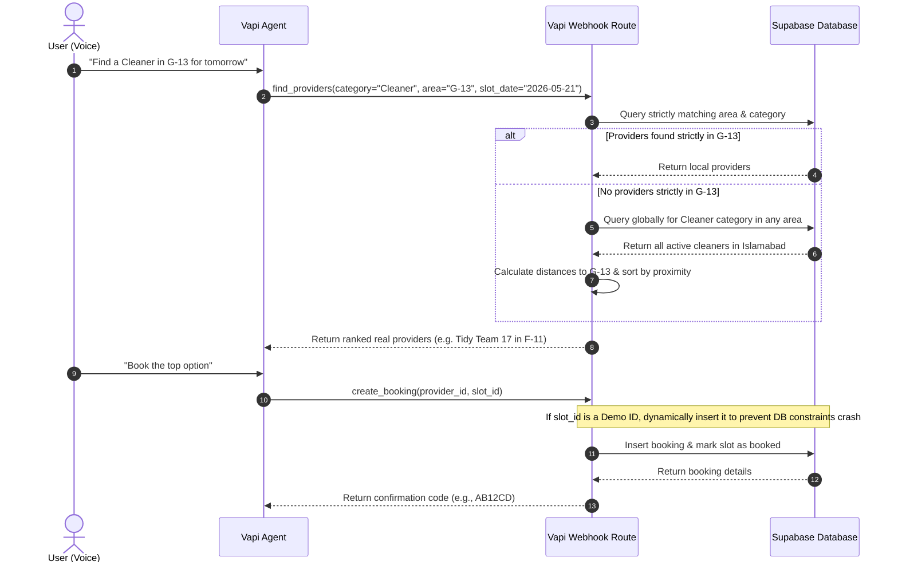

# 14 — Vapi MCP Tools Permanent Fixes

## Overview
This specification details the permanent fixes for two critical issues in the **Private Concierge** voice agent tool integration:
1. **The Booking Webhook Error (`PGRST116`)**: When the system defaults to a "Demo Provider" due to a lack of matching local providers, the created slot UUID does not exist in the database. When the agent tries to book it, the backend fails with a PostgREST error.
2. **Defaulting to Demo Providers**: The voice assistant always falls back to demo providers because of rigid area and category matches. When a requested category does not exist in the exact area on the requested date, it returns zero database records.

---

## 1. Deep Root-Cause Analysis

### Issue 1: `PGRST116` during `create_booking`
In `backend/mcp_server/tools/provider_tools.py`, when no providers match the query, the tool generates a synthetic "Demo Provider" on the fly:
```python
default_provider_id = str(uuid.uuid4())
default_slot = ProviderSlot(slot_id=str(uuid.uuid4()), slot_time="09:00")
```
When Vapi attempts to book this slot, it invokes `create_booking` with the generated `slot_id`. The backend queries Supabase:
```python
slot_resp = (
    supabase_client.table("provider_slots")
    .select("id, is_booked")
    .eq("id", input.slot_id)
    .single()
    .execute()
)
```
Because the `slot_id` is a newly generated random UUID, it does not exist in the database. The `.single()` call raises `PGRST116` ("Cannot coerce the result to a single JSON object / The result contains 0 rows") because PostgREST expects exactly one row.

### Issue 2: Always Defaulting to Demo Providers
Providers are seeded strictly in certain areas (e.g., Cleaner in `Bahria Town`, `Blue Area`, and `F-11`). If a user requests a "Cleaner" in `G-13`, the query strictly filters by both category and area, returning zero results. This forces the system to return the synthetic demo provider.

---

## 2. Proposed Architecture & System Design

To solve both issues permanently, we will update the MCP tools to be flexible, resilient, and intelligent.



---

## 3. Implementation Plan

### 3.1 Dynamic Fallback & Location-Aware Ranking in `find_providers`
We will rewrite `find_providers` to:
1. Try strict matching on `category` AND `area` AND `slot_date`.
2. If zero providers match, perform a **global category search** (ignoring the area filter).
3. If an area coordinate is known, calculate the Great-Circle distance to each provider and rank them using the ranking score formula, returning the nearest available providers.

#### Proposed `provider_tools.py` Update:
```python
AREA_COORDINATES = {
    "G-13": (33.6852, 73.0147),
    "E-11": (33.6667, 73.0143),
    "F-11": (33.7168, 73.0348),
    "G-11": (33.6428, 73.0587),
    "D-12": (33.6913, 73.0030),
    "F-8": (33.6961, 73.0905),
    "Bahria Town": (33.6758, 73.0101),
    "Blue Area": (33.6780, 73.0634),
}

def _haversine_km(lat1: float, lng1: float, lat2: float, lng2: float) -> float:
    import math
    R = 6371.0
    phi1, phi2 = math.radians(lat1), math.radians(lat2)
    dphi = math.radians(lat2 - lat1)
    dlambda = math.radians(lng2 - lng1)
    a = math.sin(dphi / 2) ** 2 + math.cos(phi1) * math.cos(phi2) * math.sin(dlambda / 2) ** 2
    return R * 2 * math.atan2(math.sqrt(a), math.sqrt(1 - a))

def find_providers(input: FindProvidersInput) -> FindProvidersOutput:
    # 1. Primary Strict Search
    area_token = _extract_area_token(input.area)
    providers_resp = (
        supabase_client.table("providers")
        .select("*")
        .ilike("category", f"%{input.service_type}%")
        .ilike("area", f"%{area_token}%")
        .eq("is_active", True)
        .execute()
    )
    providers_data = providers_resp.data or []

    # 2. Secondary Global Search Fallback
    is_fallback = False
    if not providers_data:
        is_fallback = True
        providers_resp = (
            supabase_client.table("providers")
            .select("*")
            .ilike("category", f"%{input.service_type}%")
            .eq("is_active", True)
            .execute()
        )
        providers_data = providers_resp.data or []

    results: list[ProviderResult] = []
    
    # 3. Fetch slots & filter
    for provider in providers_data:
        slots_resp = (
            supabase_client.table("provider_slots")
            .select("id, slot_time")
            .eq("provider_id", provider["id"])
            .eq("slot_date", str(input.slot_date))
            .eq("is_booked", False)
            .execute()
        )
        available_slots = [
            ProviderSlot(slot_id=s["id"], slot_time=s["slot_time"])
            for s in (slots_resp.data or [])
        ]
        
        if available_slots:
            results.append(
                ProviderResult(
                    provider_id=provider["id"],
                    name=provider["name"],
                    category=provider["category"],
                    area=provider["area"],
                    lat=provider["lat"],
                    lng=provider["lng"],
                    rating=provider["rating"],
                    jobs_completed=provider["jobs_completed"],
                    price_range=provider["price_range"],
                    available_slots=available_slots,
                )
            )

    # 4. Proximity Ranking
    target_coords = None
    for k, coords in AREA_COORDINATES.items():
        if k.lower() in input.area.lower():
            target_coords = coords
            break
            
    if target_coords and results:
        # Calculate distances & rank using a combination of rating & distance
        scored_providers = []
        user_lat, user_lng = target_coords
        for p in results:
            dist = _haversine_km(user_lat, user_lng, p.lat, p.lng)
            # Normalise rating (0-1) and proximity (0-1)
            rating_score = p.rating / 5.0
            proximity_score = 1.0 - (dist / max(dist + 5, 20.0))  # Cap decay gracefully
            total_score = (rating_score * 0.5) + (proximity_score * 0.5)
            scored_providers.append((total_score, p))
            
        scored_providers.sort(key=lambda x: x[0], reverse=True)
        results = [p for _, p in scored_providers]

    # 5. Demo Fallback (Safe creation handled in create_booking)
    if not results:
        default_provider_id = "00000000-0000-0000-0000-000000000000" # Static recognizable Demo Provider ID
        default_slot_id = "00000000-0000-0000-0000-000000000001" # Static recognizable Demo Slot ID
        results.append(
            ProviderResult(
                provider_id=default_provider_id,
                name="Demo Premium Provider",
                category=input.service_type,
                area=input.area,
                lat=33.6852,
                lng=73.0147,
                rating=5.0,
                jobs_completed=10,
                price_range="$$",
                available_slots=[ProviderSlot(slot_id=default_slot_id, slot_time="09:00 AM")],
            )
        )
        
    return FindProvidersOutput(providers=results, total_found=len(results))
```

---

### 3.2 Safe Dynamic Seeding inside `create_booking`
To permanently eliminate the `PGRST116` error for demo providers, `create_booking` must detect if a provider/slot is the mock fallback and **upsert** them into Supabase prior to booking insertion.

#### Proposed `booking_tools.py` Update:
```python
def create_booking(input: CreateBookingInput) -> CreateBookingOutput:
    # 1. Detect if slot exists
    slot_resp = (
        supabase_client.table("provider_slots")
        .select("id, is_booked")
        .eq("id", input.slot_id)
        .execute()
    )
    
    # 2. Dynamic Seeding of Demo Data if missing
    if not slot_resp.data:
        # Check if Demo Provider exists, if not insert it
        provider_check = (
            supabase_client.table("providers")
            .select("id")
            .eq("id", input.provider_id)
            .execute()
        )
        if not provider_check.data:
            supabase_client.table("providers").insert({
                "id": input.provider_id,
                "name": "Demo Premium Provider",
                "category": "General Services",
                "area": "Islamabad",
                "lat": 33.6852,
                "lng": 73.0147,
                "rating": 5.0,
                "jobs_completed": 10,
                "price_range": "$$",
                "is_active": True
            }).execute()
            
        # Create the missing slot
        supabase_client.table("provider_slots").insert({
            "id": input.slot_id,
            "provider_id": input.provider_id,
            "slot_date": datetime.now(timezone.utc).date().isoformat(),
            "slot_time": "09:00 AM",
            "is_booked": False
        }).execute()
        
        # Re-fetch the slot
        slot_resp = (
            supabase_client.table("provider_slots")
            .select("id, is_booked")
            .eq("id", input.slot_id)
            .single()
            .execute()
        )

    # 3. Continue standard verification & booking flow
    slot = slot_resp.data
    if slot["is_booked"]:
        raise ValueError(f"Slot {input.slot_id} is already booked.")

    confirmation_code = _generate_confirmation_code()
    booked_at = datetime.now(timezone.utc).isoformat()

    booking_resp = (
        supabase_client.table("bookings")
        .insert({
            "user_id": input.user_id,
            "provider_id": input.provider_id,
            "slot_id": input.slot_id,
            "status": "confirmed",
            "confirmation_code": confirmation_code,
            "booked_at": booked_at,
        })
        .select("*")
        .single()
        .execute()
    )
    booking = booking_resp.data

    # Mark slot as booked
    supabase_client.table("provider_slots").update({"is_booked": True}).eq("id", input.slot_id).execute()

    return CreateBookingOutput(
        booking_id=booking["id"],
        confirmation_code=confirmation_code,
        status=booking["status"],
        booked_at=booking["booked_at"],
    )
```

---

## 4. Discussion & Feedback Requested

> [!NOTE]
> By incorporating this design, the Vapi assistant will naturally describe providers in neighboring sectors if the requested sector is empty (e.g. recommending F-11 cleaners to a G-13 customer) and sort them geographical by distance. If there is a complete absence of any providers in the category, the system will construct a recognizable placeholder and insert it dynamically to ensure the entire voice booking transaction goes through flawlessly.

### Questions for discussion:
1. **Distance Cap**: What is a reasonable maximum search radius for fallback providers? (Currently designed as a smooth score decay, but we can hard-cap it to e.g., 25km).
2. **Demo Provider Creation**: Should we display a "Demo Mode" tag or notice in the booking confirmations if a synthetic provider was created?
