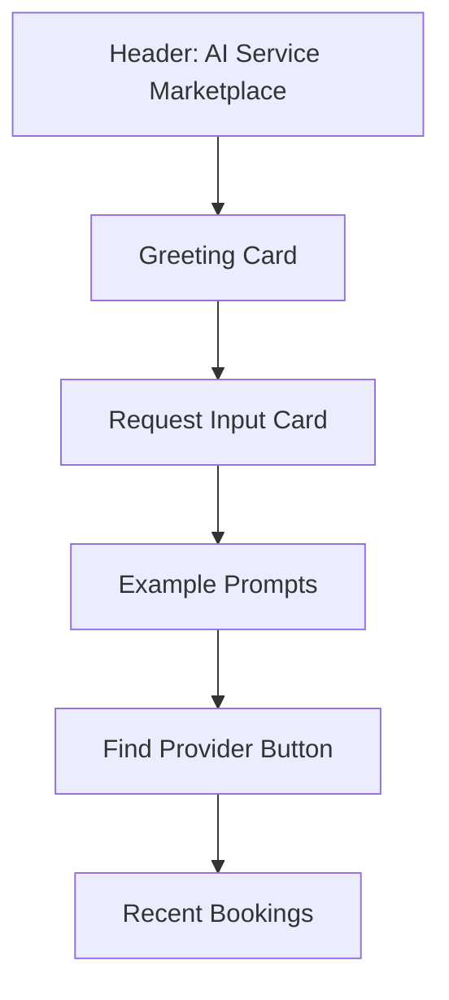
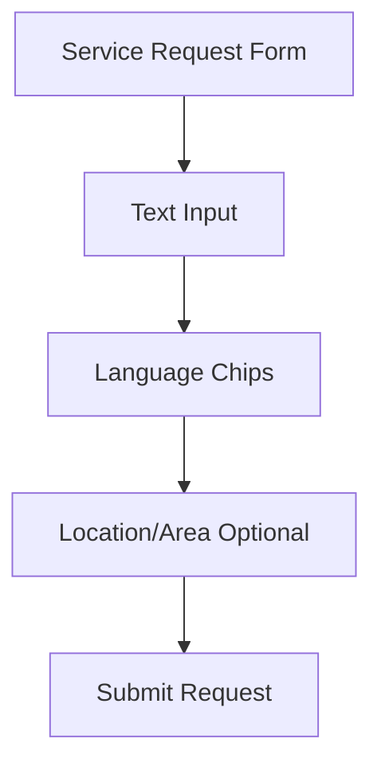
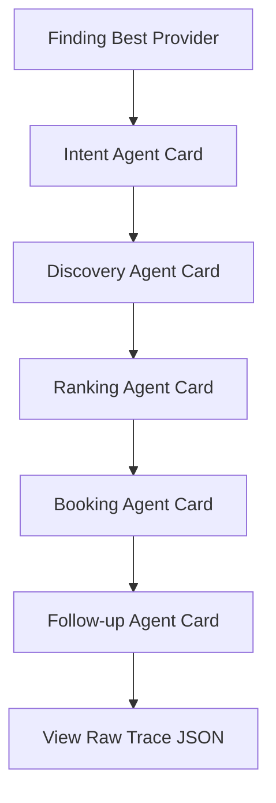
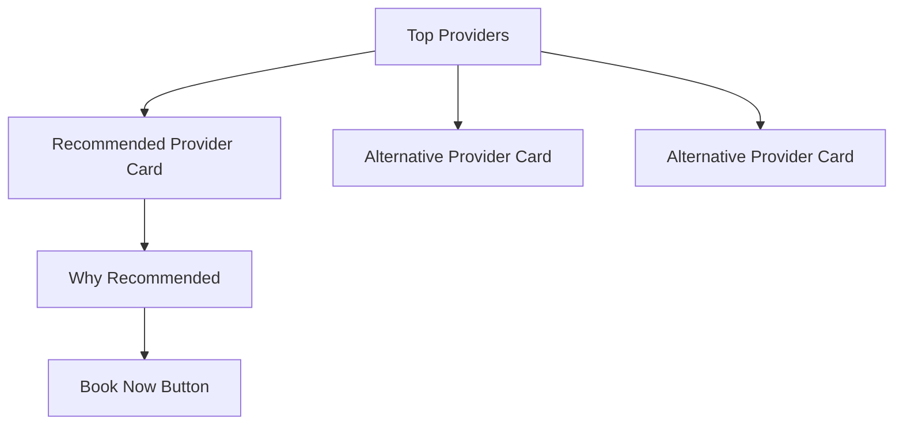
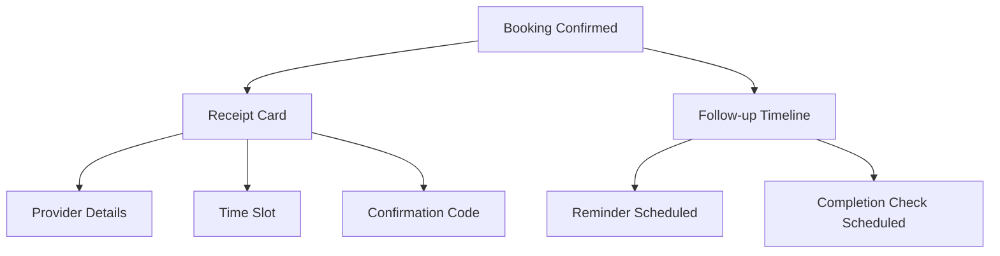
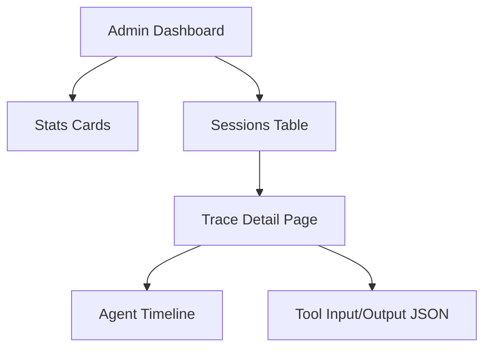

# UI Context

## Frontend Routes (Expo Router)

```txt
app/
  _layout.tsx
  index.tsx

  auth/
    sign-in.tsx
    sign-up.tsx

  customer/
    _layout.tsx
    home.tsx
    request.tsx
    thinking/[sessionId].tsx
    providers/[sessionId].tsx
    booking/[bookingId].tsx
    history.tsx
    profile.tsx

  admin/
    _layout.tsx
    dashboard.tsx
    traces.tsx
    traces/[sessionId].tsx
    bookings.tsx
    providers.tsx
```

## Page Layout Overview

### Customer Home


### Request Screen


### Agent Thinking Screen


### Provider Selection Screen


### Booking Confirmation Screen


### Admin Trace Dashboard

